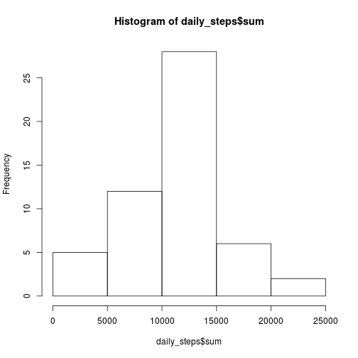

## Loading and preprocessing the data

```r
data <- read.csv(unzip("activity.zip"))
```

It is a simple data frame with date, steps and interval variables. 


```r
str(data)
```

```
## 'data.frame':	17568 obs. of  3 variables:
##  $ steps   : int  NA NA NA NA NA NA NA NA NA NA ...
##  $ date    : Factor w/ 61 levels "2012-10-01","2012-10-02",..: 1 1 1 1 1 1 1 1 1 1 ...
##  $ interval: int  0 5 10 15 20 25 30 35 40 45 ...
```

## What is mean total number of steps taken per day?

Now I will group the dataframe by date


```r
g <- group_by(data, date)
```

Here I save the intermediate result into the object *g*. Now I'm ready to extract useful values.


```r
daily_steps <- summarise(g, sum=sum(steps))
```

Let's look to the total number of steps taken per day

```r
hist(daily_steps$sum)
```

 
Most of the days the number of step was between 10000 and 15000.

I have a kind of problem with NA values.

```r
summary(daily_steps$sum)
```

```
##    Min. 1st Qu.  Median    Mean 3rd Qu.    Max.    NA's 
##      41    8841   10760   10770   13290   21190       8
```


I'll just drop the days with NA values.


```r
good_daily_steps <- daily_steps[!is.na(daily_steps$sum)]
```

Finally, we're ready to get some statistics about steps taken per day, including mean and median values. 


```r
summary(good_daily_steps$sum)
```

```
##    Min. 1st Qu.  Median    Mean 3rd Qu.    Max.    NA's 
##      41    8841   10760   10770   13290   21190       8
```


Mean is a little bit more than 10000 steps. 

Median is about the same value (just less by 10)

Done.


## What is the average daily activity pattern?


## Imputing missing values


## Are there differences in activity patterns between weekdays and weekends?
