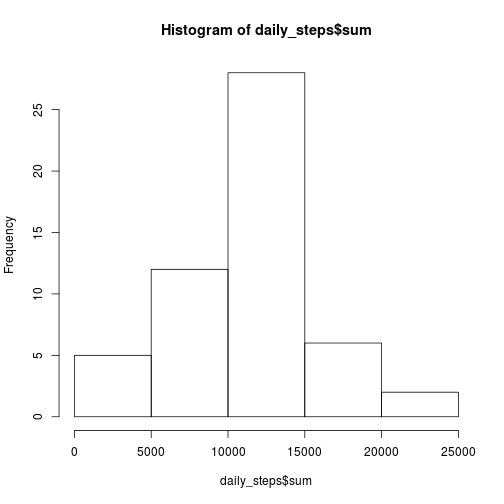
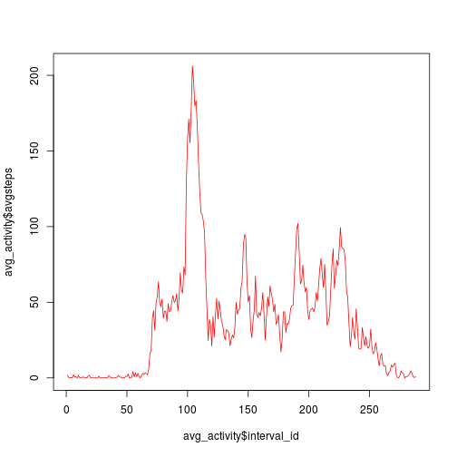

# Stepping activity research

## Loading and preprocessing the data
The source data could be read from the activity.zip file provided it is in the current directory


```r
data <- read.csv(unzip("activity.zip"))
```

It is a simple data frame with **date**, **steps** and **interval** variables. 


```r
str(data)
```

```
## 'data.frame':	17568 obs. of  3 variables:
##  $ steps   : int  NA NA NA NA NA NA NA NA NA NA ...
##  $ date    : Factor w/ 61 levels "2012-10-01","2012-10-02",..: 1 1 1 1 1 1 1 1 1 1 ...
##  $ interval: int  0 5 10 15 20 25 30 35 40 45 ...
```

**steps** variable means number of steps made by a subject within an **interval** on the **date**. 

Here **date** is a factor, and **interval** is an number that means hour*100 + minute when the interval starts. I.e interval = 2215 means interval that starts on 22:15 and longs 5 minutes. So there are no intervals that end with 60, 65, 70, and so on until 95. Look at the sample. 


```r
rnd_offset <- floor(runif(1)*(length(data$interval)-12)) 
data[rnd_offset:(rnd_offset+12),]
```

```
##      steps       date interval
## 4759    86 2012-10-17     1230
## 4760     0 2012-10-17     1235
## 4761     0 2012-10-17     1240
## 4762     0 2012-10-17     1245
## 4763     0 2012-10-17     1250
## 4764     0 2012-10-17     1255
## 4765    30 2012-10-17     1300
## 4766     0 2012-10-17     1305
## 4767     0 2012-10-17     1310
## 4768     8 2012-10-17     1315
## 4769     0 2012-10-17     1320
## 4770   285 2012-10-17     1325
## 4771   146 2012-10-17     1330
```

I'm going to help future work by enumerating intervals


```r
data$interval_id <- as.numeric(as.factor(data$interval))
head(data)
```

```
##   steps       date interval interval_id
## 1    NA 2012-10-01        0           1
## 2    NA 2012-10-01        5           2
## 3    NA 2012-10-01       10           3
## 4    NA 2012-10-01       15           4
## 5    NA 2012-10-01       20           5
## 6    NA 2012-10-01       25           6
```


## What is mean total number of steps taken per day?

Now I will group the dataframe by date


```r
library(dplyr)
g <- group_by(data, date)
```

Here I save the intermediate result into the temporary object *g*. Now I'm ready to extract useful values.


```r
daily_steps <- summarise(g, sum=sum(steps))
```

Let's look to the total number of steps taken per day

```r
hist(daily_steps$sum)
```

 


So, most of the days the number of steps was between 10000 and 15000.

But I have a kind of problem with NA values.

```r
summary(daily_steps$sum)
```

```
##    Min. 1st Qu.  Median    Mean 3rd Qu.    Max.    NA's 
##      41    8841   10760   10770   13290   21190       8
```


I'll just drop records with NA values.


```r
good_daily_steps <- daily_steps[!is.na(daily_steps$sum),]
```

Finally, I'm ready to get some preliminary statistics about steps taken per day, including mean and median values. 


```r
summary(good_daily_steps$sum)
```

```
##    Min. 1st Qu.  Median    Mean 3rd Qu.    Max. 
##      41    8841   10760   10770   13290   21190
```


Mean is a little bit more than 10000 steps. 

Median is about the same value (just less by 10)

Done.


## What is the average daily activity pattern?

To get the answer I'll need to find the average of all steps made in the each interval on every day of the trial. I also need to skip NA values.


```r
g <- group_by(data,interval_id)
avg_activity <- summarise(g,avgsteps=mean(steps,na.rm=TRUE))
```


Let's take a look.


```r
plot (avg_activity$interval_id,avg_activity$avgsteps,type="l",col="red")
```

 

Here it is. 
Maximum value is 


```r
M <- max(avg_activity$avgsteps)
print(M)
```

```
## [1] 206.1698
```

That corresponds to interval_id below


```r
M_x <- avg_activity[avg_activity$avgsteps == M,]$interval_id
print(M_x)
```

```
## [1] 104
```

And it consequently corresponds to the interval below


```r
data[data$interval_id==M_x,]$interval[1]
```

```
## [1] 835
```

That is a 8:35 am.

## Imputing missing values

Let's substitute all NA values with corresponding interval average values.


```r
patched_data <- data
na_indices <- is.na(patched_data$steps)
patched_data[na_indices,]$steps <- 
  avg_activity$avgsteps[patched_data[na_indices,]$interval_id]
head(patched_data)
```

```
##       steps       date interval interval_id
## 1 1.7169811 2012-10-01        0           1
## 2 0.3396226 2012-10-01        5           2
## 3 0.1320755 2012-10-01       10           3
## 4 0.1509434 2012-10-01       15           4
## 5 0.0754717 2012-10-01       20           5
## 6 2.0943396 2012-10-01       25           6
```


## Are there differences in activity patterns between weekdays and weekends?

Ok, let's translate dates into weekdays.
First of all, let's group by date again.


```r
patched_data$date1 <- strptime(as.character(patched_data$date),"%Y-%m-%d")
```

